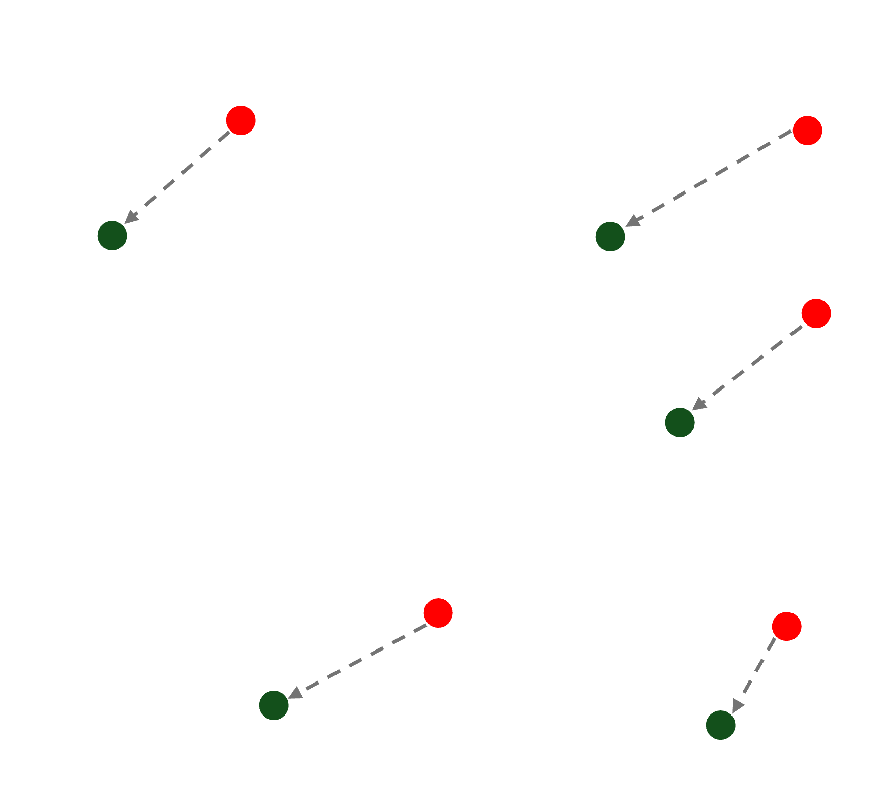
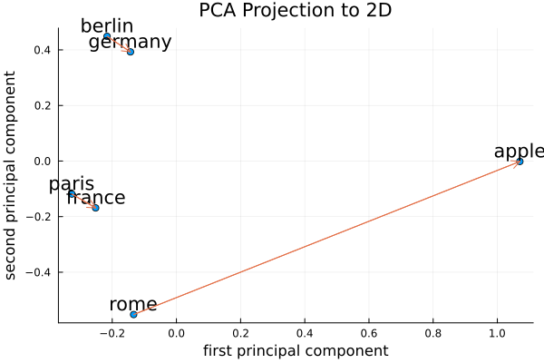

[](https://codecov.io/gh/graupnej/GroupIWord2Vec.jl)
[](https://github.com/graupnej/GroupIWord2Vec.jl/actions/workflows/CI.yml?query=branch%3Amain)
[](https://graupnej.github.io/GroupIWord2Vec.jl/dev/)

<div align="center">
  
  <h1>Word2Vec</h1>
  A Julia package that implements some tools for running and testing word-embedding algorithms
  <br/>
  <a href="https://julialang.org/downloads/">
    
  </a>
</div>

## What's it about
[Word Embeddings](https://en.wikipedia.org/wiki/Word_embedding) are numerical representations of words in a high-dimensional vector space, where words with similar meanings are positioned closer together. These vectors capture semantic relationships between words, allowing machines to understand language context and meaning through mathematical operations. They serve as the foundation for many natural language processing tasks.

## Getting Started
### 1) Download
We can't use Pluto's environments but have to create our own

```julia
julia> using Pkg
julia> Pkg.activate("MyEnv")
julia> Pkg.add(url="https://github.com/graupnej/GroupIWord2Vec.jl")
julia> using GroupIWord2Vec
```

Below is an overview of the project's main components

```
GroupIWord2Vec.jl               
├── src/                        # Contains core modules for the package
│   ├── GroupIWord2Vec.jl       # Main entry point for the project
│   ├── functions.jl            # Word/vector functions
│   └── model.jl                # Model functions
├── test/                       # Unit tests to validate functionalities
│   ├── runtests.jl             # Combination of every testing routine
│   ├── test_functions.jl       # Testing routine for word/vector functions 
│   └── test_model.jl           # Testing routine for model functions
├── docs/                       # Documentation for the package
├── Manifest.toml               # Detailed dependency lock file that tracks exact versions of project dependencies
├── Project.toml                # Project configuration file defining package dependencies
└── README.md                   # Main documentation file containing getting started
```

### 2) Running a simple example
Download [_text8_](https://mattmahoney.net/dc/text8.zip) and store it in the current working directory. To train the model with this text corpus use ``train_model()``

```julia
julia> train_model("text8", "text8.txt", verbose = true)
```

The resulting word vectors are saved in a text format file (here) named _text8.txt_.
Import the obtained word vectors from _text8.txt_ into Julia using ``load_embeddings()``

```julia
julia> model = load_embeddings("./text8.txt")
```

#### Some functionalities

- ``get_vector_from_word()``: Get the vector representation of a word

```julia
julia> get_vector_from_word(model, "king")
```

- ``cosine_similarity()``: Returns cosine of the angle between two vectors in a word embedding space

```julia
julia> cosine_similarity(model, "king", "prince")
```

It ranges from -1 to 1, where 1 indicates high similarity, 0 indicates no similarity and -1 indicates opposite directions.
 
- ``get_top_similarity_of_word()``: Find the n most similar words to a given word and return the matching strings

```julia
julia> get_top_similarity_of_word(model, "king", 5)
```

- ``word_analogy()``: Performs word analogy calculations (e.g. king - man + woman = queen)
  
```julia
julia> word_analogy(model, ["king", "woman"], ["man"])
```

#### Display Data
- ``show``_``relations()``: Creates a [PCA Projection](https://en.wikipedia.org/wiki/Principal_component_analysis) to 2D of words with connecting vectors 

```julia
julia> show_relations("berlin", "germany", "paris", "france", "rome", "apple", wv=model, save_path="my_custom_plot.png")
```

<div align="center">
  
</div>

### 3) Running a large example
As an alternative (larger) example use a text corpus from e.g. [FastText](https://fasttext.cc/docs/en/pretrained-vectors.html) (.bin & .vec file) with about 33 million words. Store this file in the current working directory and apply the same functions as in the previous example.

## For Developers
### 1) Download the code

``` bash
git clone https://github.com/graupnej/GroupIWord2Vec.jl.git
```

Navigate to the cloned directory and launch julia. Activate the project environment to tell Julia to use the Project.toml

```julia
julia> using Pkg
julia> Pkg.activate(".")
```

Resolve dependencies and create a Manifest.toml file

```julia
julia> Pkg.instantiate()
```

Precompile the project to ensure all dependencies and the code is ready

```julia
julia> Pkg.precompile()
```

### 2) Run tests
To verify everything is working correctly run the code coverage tests

```julia
julia> Pkg.test("GroupIWord2Vec")
```

This covers all the tests. To execute a specific test (e.g. Functions)

```julia
julia> Pkg.test("GroupIWord2Vec", test_args=["Functions"])
```

## Dependencies
The package relies on the following non-standard Julia packages:

       DelimitedFiles        # Provides functionality for reading and writing delimited text files
       LinearAlgebra         # Offers a suite of mathematical tools and operations for linear algebra
       Plots                 # For visualization functions
       Word2vec.jll          # Links to the underlying Word2Vec implementation (C code)
       Statistics            # For basic statistical operations (mean, std, var, etc.)

The files Project.toml and Manifest.toml in the created environment manage dependencies.

## References
The text corpus for the simple example (_text8_) is a preprocessed version of the first 100 million bytes of the English Wikipedia dump from March 3, 2006. It has been filtered to include only lowercase letters (a–z) and spaces, reducing the dataset's size to approximately 100 MB. It is commonly used for training and evaluating language models.

The text corpus for the large example were obtained using the skip-gram model described in Bojanowski et al. (2016) with default parameters.

       P. Bojanowski*, E. Grave*, A. Joulin, T. Mikolov, Enriching Word Vectors with Subword Information

As inspiration on how to properly develop julia packages, organize source files, write meaningful tests and more read [here](https://adrianhill.de/julia-ml-course/write/).

## Contributors
[](https://github.com/graupnej/GroupIWord2Vec.jl/graphs/contributors)
