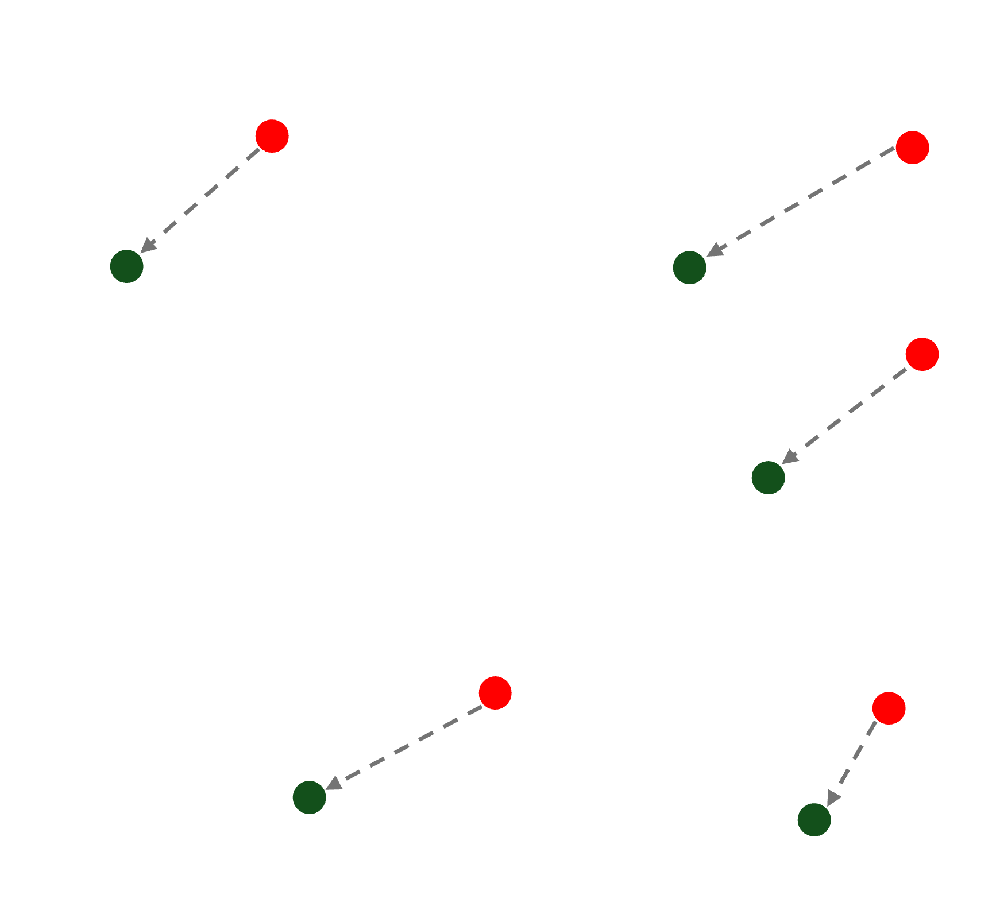

# Getting Started - Installation and Usage Guide

## 1) Clone the github repository
First, clone the repository to your local machine (replace <username> with your details):

       git clone https://github.com/<username>/GroupIWord2Vec.jl.git

Once downloaded, move the directory into your julia directory:

       mv GroupIWord2Vec.jl ~.julia/

## 2) Open the package in Julia
Launch the Julia REPL and navigate to the cloned directory:

       cd ~.julia/GroupIWord2Vec

and activate Julia's package environment:

       using Pkg
       
Here, activate the project environment:

       Pkg.activate(".")         # Activate the local environment
       Pkg.instantiate()         # Install dependencies from the Manifest.toml

This instructs Julia to use the Project.toml and Manifest.toml files in the current directory for managing dependencies.
In Julia's package management system (Pkg mode, entered by typing ]) trigger the build process for the package:

       build GroupIWord2Vec

Within the Julia REPL, load the package into the current session

       using GroupIWord2Vec

## 3) Select and implement a pre-trained Word2Vec model e.g. FastText English (.bin & .vec file):

       https://fasttext.cc/docs/en/pretrained-vectors.html

Once downloaded, move the directory to the package directory:

       mv wiki.en ~.julia/GroupIWord2Vec

This is what the file structure should look like:

       .julia/
           └── GroupIWord2Vec/         # Development directory for the package
               ├── src/
               │   ├── GroupIWord2Vec.jl      # Main package file
               │   ├── functions.jl           # Main functions
               ├── test/
               │   ├── runtests.jl            # Test suite
               ├── wiki.en/                   # Pretrained embeddings
               │   ├── wiki.en.vec            # Vector file
               │   ├── wiki.en.bin            # Binary file
               ├── LICENSE                    # License file
               ├── .gitignore                 # Git ignore rules
               ├── Project.toml               # Package dependencies
               ├── Manifest.toml              # Dependency snapshot
               └── README.md                  # Documentation

# Dependencies
GroupIWord2Vec.jl relies on the following non-standard Julia packages:

       DelimitedFiles        # Provides functionality for reading and writing delimited text files
       LinearAlgebra         # Offers a suite of mathematical tools and operations for linear algebra

# Examples
In the package directory:

       ~.julia/GroupIWord2Vec

Load a pre-trained model from a file in text format:

       model_vec = load_text_model("wiki.en/wiki.en.vec")

Alternatively, load a pre-trained model from a file in binary format:

       model_bin = load_text_model("wiki.en/wiki.en.bin")

Generate a word embedding for a given word using one of the loaded models:

       embedding = get_word_embedding(model_, "test")

# Run a test
In order to compare the vectors from both files you can run a test in the package directory:

       Pkg.test("GroupIWord2Vec")

This compares the vectors for certain predefined words from both files to check whether the files have been read similarly or not.

# References
We have used the word vectors that were obtained using the skip-gram model described in Bojanowski et al. (2016) with default parameters.

       P. Bojanowski*, E. Grave*, A. Joulin, T. Mikolov, Enriching Word Vectors with Subword Information
